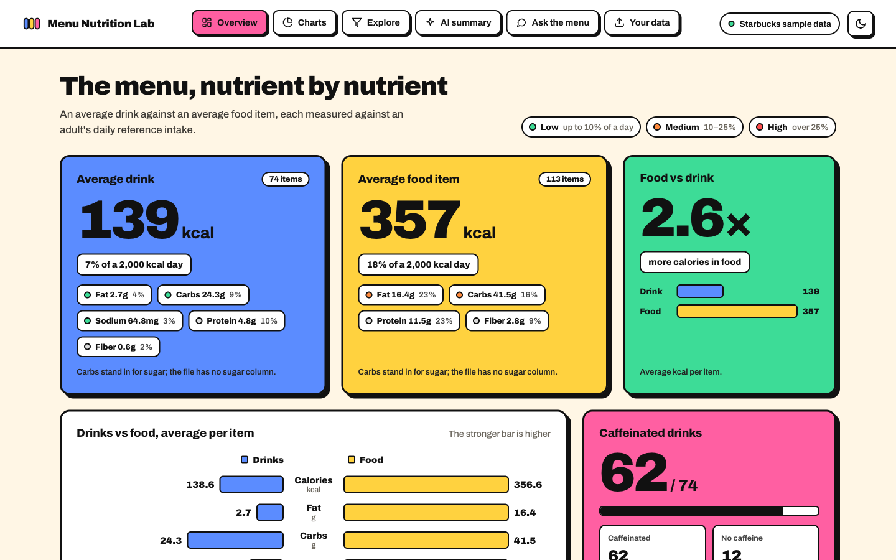
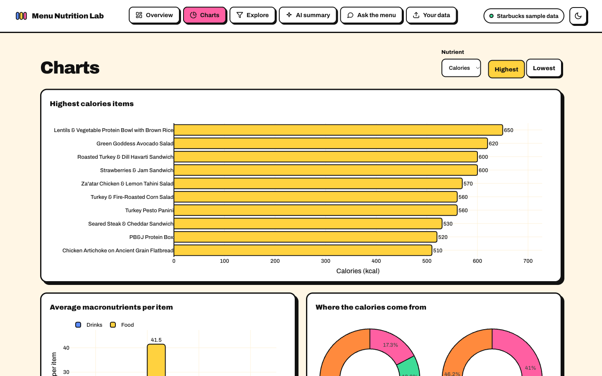
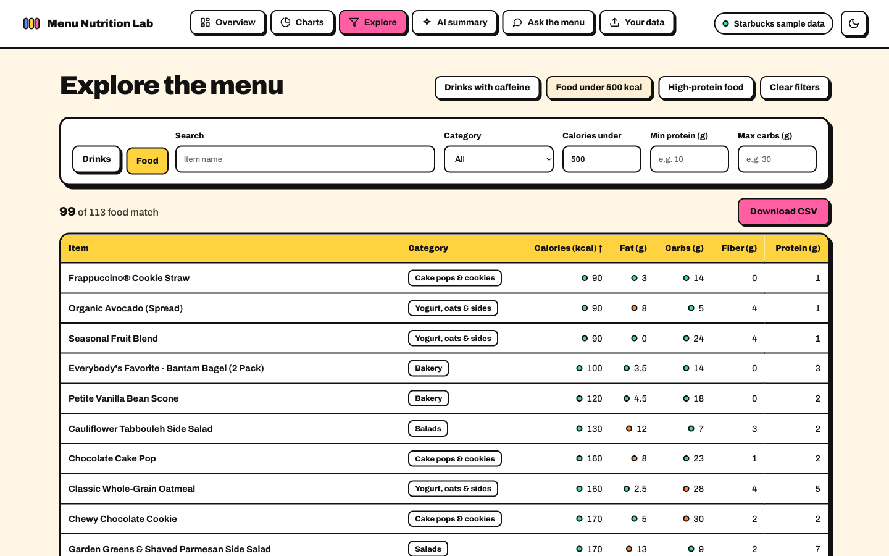
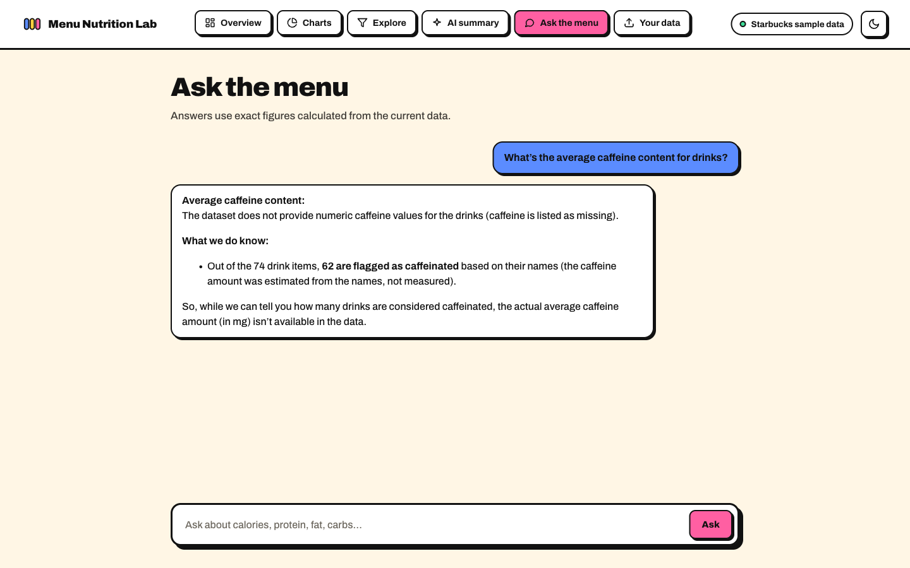
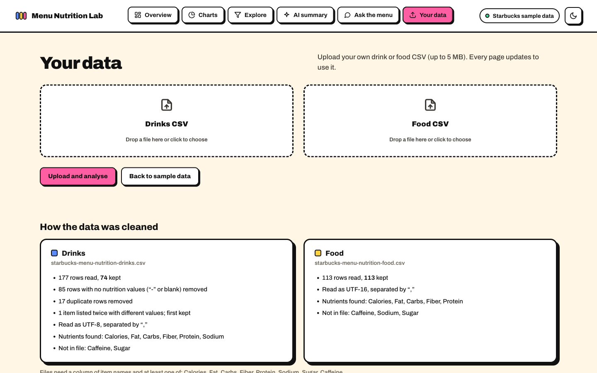
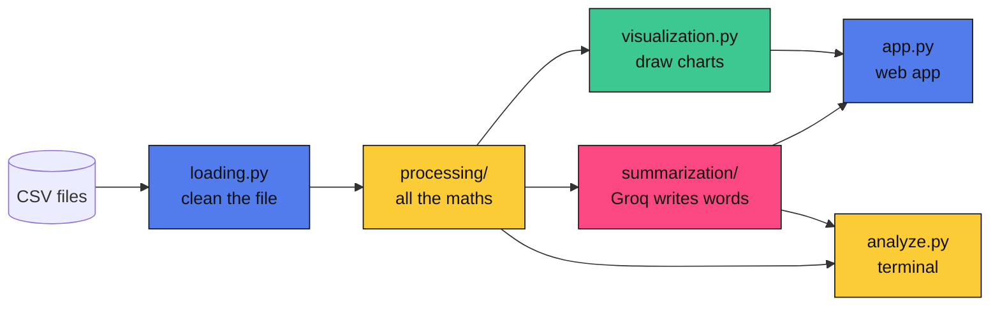

# Menu Nutrition Lab

**Starbucks menu nutrition, cleaned with pandas, explained by an LLM.**
Load messy CSVs, explore the numbers in charts and filters, and ask questions in plain English.


**Live demo: [menu-nutrition-lab.onrender.com](https://menu-nutrition-lab.onrender.com)** (free hosting, so the first visit may take ~50 s to wake up)



---

## Run it in 1 minute

```bash
python -m venv .venv
source .venv/bin/activate        # Windows: .venv\Scripts\activate
pip install -r requirements.txt
cp .env.example .env             # add your Groq key
python app.py                    # open http://127.0.0.1:5000
```

Get a free Groq key at [console.groq.com/keys](https://console.groq.com/keys). No key yet? Everything except the two AI pages still works.
Run the tests with `pytest`.

**Deploying:** the `backend` branch adds `render.yaml` (gunicorn, health check at `/api/health`);
Render deploys it on every push. Set `GROQ_API_KEY` and `FLASK_SECRET_KEY` in Render's environment.

---

## What's inside

| | Page | What you can do |
|---|---|---|
| 📊 | **Overview** | Averages, totals, fat-to-protein ratio, drinks vs food |
| 📈 | **Charts** | 8 interactive charts (bar, donut, sunburst, box, scatter) |
| 🔎 | **Explore** | Filter (e.g. *drinks with caffeine*, *food under 500 kcal*), sort, download CSV |
| ✍️ | **AI summary** | A Groq-written summary, focused on sugar, calories or protein |
| 💬 | **Ask the menu** | A ChatGPT-style chat: ask in plain English, answers stream in, chats are saved, and the calculation is shown |
| 📁 | **Your data** | Upload a drinks CSV, a food CSV or both, and see exactly how each was cleaned |

<table>
<tr>
<td></td>
<td></td>
</tr>
<tr>
<td></td>
<td></td>
</tr>
</table>

---

## How it works



**The key idea: the LLM never does maths.** pandas calculates every number.

- **Summaries:** Groq gets a small sheet of pre-computed facts and turns it into readable text.
- **Questions:** Groq picks a tool (`aggregate`, `rank_items`, `list_items`, `find_items`), pandas runs it, and Groq explains the result. So *"average fat in food"* is an exact **16.4 g**, not a guess.
- **Chat memory:** the last three exchanges are sent as they were, and older messages are folded into a short running summary, so a follow-up like *"give me the names of those drinks"* still works deep into a conversation without hitting the free tier's token limit. Answers stream in word by word (with a Stop button), and chats are saved in your browser.

Each layer only uses the layers before it. `tests/test_structure.py` checks this automatically: only `app.py` uses Flask, and only `summarization/client.py` talks to Groq.

```
nutrition/
├── config.py           settings: file paths, nutrient names, model
├── loading.py          read and clean a messy CSV
├── processing/         stats, comparison, filters, exact queries
├── visualization.py    the 8 Plotly charts
├── summarization/      Groq client, summary, question answering
└── store.py            each browser's uploaded data
app.py                  Flask routes (web)
analyze.py              the same features from the terminal
tests/                  66 tests, one file per part
```

---

## The data was messy, so it gets cleaned

| Problem in the files | What the app does |
|---|---|
| Food file is **UTF-16** (a plain `read_csv` fails) | Detects the encoding automatically |
| **85** drink rows are only `-` | Treats placeholders as missing and drops empty rows |
| **17** duplicate rows, 1 item listed twice with different values | Removes exact duplicates, keeps the first and reports it |
| Headers like `" Carb. (g)"`, unnamed name column | Matches each header to a known nutrient |
| Values like `1,200`, `45 mg`, `n/a` | Parses them into numbers |

**Result:** drinks go from 177 rows to 74 clean items, and food keeps all 113. Every fix is shown on the *Your data* page.

**Honest about gaps.** The files have **no sugar or caffeine columns**:
- the app uses carbs in place of sugar and labels it that way;
- caffeine is estimated from drink names (yes/no only), also labelled.

If you upload a file with real `Sugar` or `Caffeine` columns, the app uses them automatically.

**Uploading your own files**
- **One file is analysed alone.** Upload only drinks and the app shows only drinks: no comparison, and nothing
  borrowed from the sample food file. Upload the other file later to add it, or remove either one.
- **Files in the wrong box are caught.** A food menu dropped in the Drinks box is rejected with a message
  ("This looks like a food file…"), judged from the item names.
- **Nothing goes stale.** A new upload clears saved chats and summaries, and every page reloads. If the data
  changes in another tab or the server restarts, the page notices and refreshes itself.

---

## Design decisions and trade-offs

| Decision | Gain | Cost |
|---|---|---|
| **Tool calling** instead of sending raw rows to the LLM | Exact numbers, small prompts (fits Groq's free tier) | One extra API round trip per question |
| **Flask + plain JavaScript** | One command to run, no build step | Less structure than a front-end framework |
| **Uploads kept in memory, per browser session** | Private to each visitor, no database | Lost when the server restarts (the page notices and says so) |
| **Charts built in Python with Plotly** | One charting library, interactive in the browser | Plotly.js loads from a CDN |
| **Bold, high-contrast UI** | Readable on a projector in a demo | Louder than a typical dashboard |

---

## Terminal version

```bash
python analyze.py                                    # cleaning report, statistics, drinks vs food
python analyze.py --show drinks --caffeine yes       # 62 of 74 drinks
python analyze.py --show food --under-calories 500   # 99 of 113 food items
python analyze.py --summary sugar                    # overview | sugar | calories | protein
python analyze.py --ask "Which drinks have the most protein?"
python analyze.py --drinks my_drinks.csv             # only your file, no comparison
```

---

- 📑 **Presentation:** [docs/Menu-Nutrition-Lab.pdf](docs/Menu-Nutrition-Lab.pdf)

